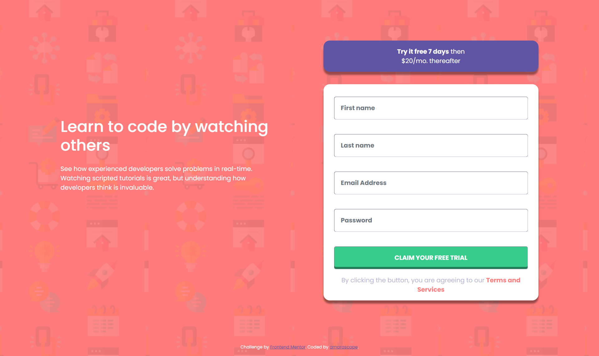
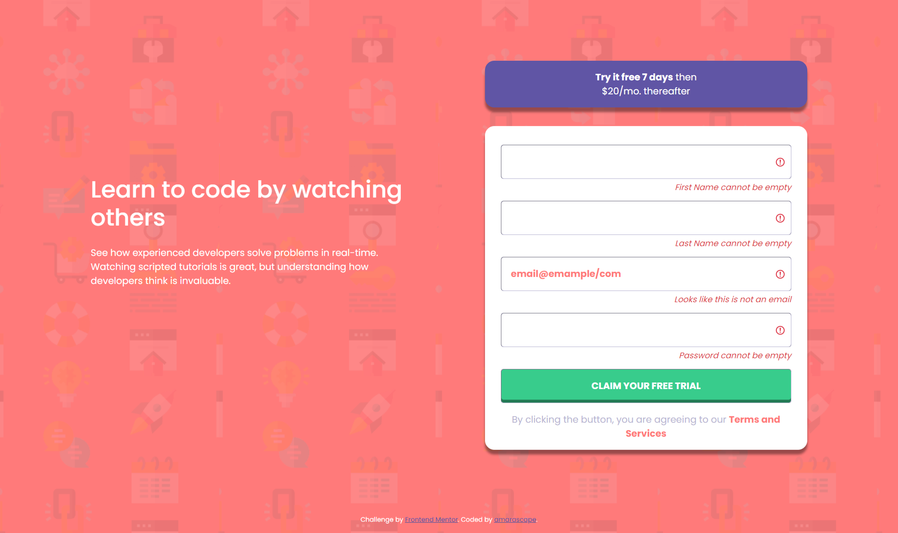

# Frontend Mentor - Intro component with sign up form solution

This is a solution to the [Intro component with sign up form challenge on Frontend Mentor](https://www.frontendmentor.io/challenges/intro-component-with-signup-form-5cf91bd49edda32581d28fd1). Frontend Mentor challenges help you improve your coding skills by building realistic projects.

## Table of contents

- [Overview](#overview)
  - [The challenge](#the-challenge)
  - [Screenshot](#screenshot)
  - [Links](#links)
- [My process](#my-process)
  - [Built with](#built-with)
  - [What I learned](#what-i-learned)
  - [Continued development](#continued-development)
  - [Useful resources](#useful-resources)
- [Author](#author)

## Overview

### The challenge

Users should be able to:

- View the optimal layout for the site depending on their device's screen size
- See hover states for all interactive elements on the page
- Receive an error message when the `form` is submitted if:
  - Any `input` field is empty. The message for this error should say _"[Field Name] cannot be empty"_
  - The email address is not formatted correctly (i.e. a correct email address should have this structure: `name@host.tld`). The message for this error should say _"Looks like this is not an email"_

### Screenshot

#### Desktop View

#### Mobile View

#### Active View


### Links

- Solution URL: [Add solution URL here](https://your-solution-url.com)
- Live Site URL: [Add live site URL here](https://your-live-site-url.com)

## My process

### Built with

- Semantic HTML5 markup
- CSS custom properties
- Flexbox
- CSS Grid
- Mobile-first workflow
- [React](https://reactjs.org/) - JS library
- [Validation · Bootstrap v5.0](https://getbootstrap.com/docs/5.0/forms/validation/)

### What I learned

- [How To Change Input Placeholder Color](https://www.w3schools.com/howto/howto_css_placeholder.asp)

```CSS
.helper-placeholder::placeholder {
  color: var(--local-red);
}
```

- [HTML input pattern Attribute](https://www.w3schools.com/tags/att_input_pattern.asp)

```html
{/* || EMAIL ADDRESS */}
<div className="input-item email-address-input">
  <input
    type="text"
    className="form-control"
    id="validationCustom03"
    placeholder="Email Address"
    pattern="[a-z0-9._%+-]+@[a-z0-9.-]+\.[a-z]{2,}$"
    required
  />
  <div className="invalid-feedback">
    Looks like this is not an email
  </div>
</div>
```

### Continued development

- Investigate Next.js

### Useful resources

- To disable default reloading of page on form submit, the forum [javascript - React - Preventing Form Submission - Stack Overflow](https://stackoverflow.com/questions/39809943/react-preventing-form-submission#:~:text=Example%3A%20http%3A//jsbin.com/vowuley/edit%3Fhtml%2Cjs%2Cconsole%2Coutput) was referenced.

- [How To Change Input Placeholder Color](https://www.w3schools.com/howto/howto_css_placeholder.asp)

- [HTML input pattern Attribute](https://www.w3schools.com/tags/att_input_pattern.asp)

- [Deployment to GitHub Pages | Create React App](https://create-react-app.dev/docs/deployment/#github-pages)

- [How to build and deploy a React app to Github pages in less than 5 minutes | by Anjali Sharma | mobile-web.dev 📱 | Medium](https://medium.com/mobile-web-dev/how-to-build-and-deploy-a-react-app-to-github-pages-in-less-than-5-minutes-d6c4ffd30f14)

## Author

- Github - [amarascape](https://github.com/amarascape)
